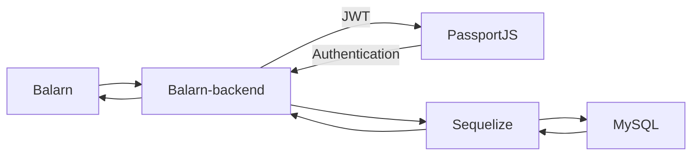

# Balarn-backend

## 📘 Description

A Personal Final-Project in CodeCamp 2019. This project is creating for everyone who wants the money management system like a virtual wallet so you can add a virtual-wallet representative
for the pouch, the bank account, and also everyday wallet. This project will make your life easier than before so you can manage an income and an outcome like a boss XD.

## 📦 Built With

- [Express](https://expressjs.com/) - A Web Application Framework
- [Passport](http://www.passportjs.org/docs/) - An Authentication Middleware for NodeJS
- [Sequelize](https://sequelize.org/) - An ORM Library for MySQL
- [MySQL2](https://www.npmjs.com/package/mysql2) - A Library for NodeJS to Connecting a MySQL DB

## 🛠 Structure





## 📋 Features

- APIs CRUD for managing users
- APIs CRUD for managing wallets
- APIs CRUD for managing transactions

## 🏷 Versioning

- Current Version: 0.1.0
- For the versions available, see the [tags on this repository.](https://github.com/buildingwatsize/balarn-backend/tags)

## 💡 Getting Started

1️⃣ Clone this project by

  ```bash
    git clone https://github.com/buildingwatsize/balarn-backend.git
  ```

2️⃣ Run Commands

  ```bash
    npm install # or just `yarn`

    npm start # or just `yarn start`

    # Default link: http://localhost:3000/
  ```

3️⃣ Add `config.json` in `./config/config.json` for more detail, next topic.

4️⃣ Enjoy with :D

## ⚙️ Configurations

Create a config.json `./config/config.json` with this detail, edit your password and database name

```json
  {
    "development": {
      "username": "root",
      "password": "YOUR_PASSWORD",
      "database": "YOUR_DATABASE_NAME",
      "host": "127.0.0.1",
      "dialect": "mysql",
      "operatorsAliases": 0,
      "port": 3306,
      "app_port": 5000
    },
    "test": {
      "username": "root",
      "password": "YOUR_PASSWORD",
      "database": "YOUR_DATABASE_NAME",
      "host": "127.0.0.1",
      "dialect": "mysql",
      "operatorsAliases": 0,
      "port": 3306,
      "app_port": 5000
    },
    "production": {
      "username": "root",
      "password": "YOUR_PASSWORD",
      "database": "YOUR_DATABASE_NAME",
      "host": "127.0.0.1",
      "dialect": "mysql",
      "operatorsAliases": 0,
      "port": 3306,
      "app_port": 5000
    }
  }
```

## Example APIs

Please go to Postman Collection [Balarn-backend.postman_collection.json](Balarn-backend.postman_collection.json)

## 😎 Author

Chinnawat Chimdee

## 🚩 Created at

9 Dec 2019
